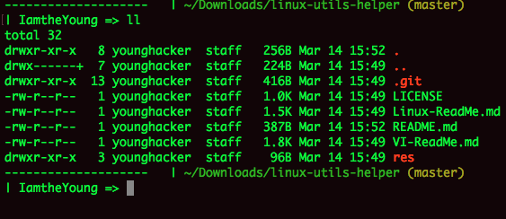
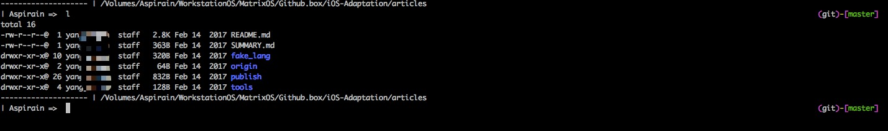

# bash-zsh-git-config
My native bashrc/bash_profile, zshrc and gitconfig config files without any plugins in terminal prompt.

## The native prompt on macOS(.bash_profile) and Fedora(.bashrc) :  

  
  

## The native prompt on zsh terminal:  

  
  

+ Linux  
    - [< Basic Linux Command in Development >](Linux-ReadMe.md)  
